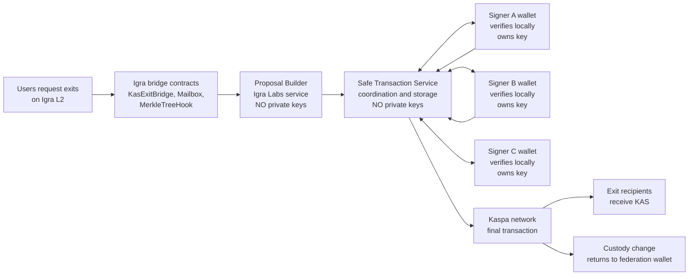
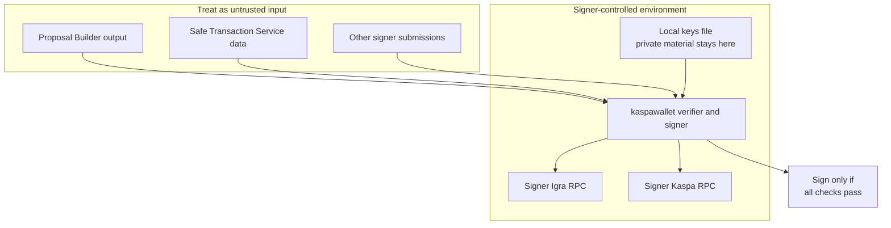
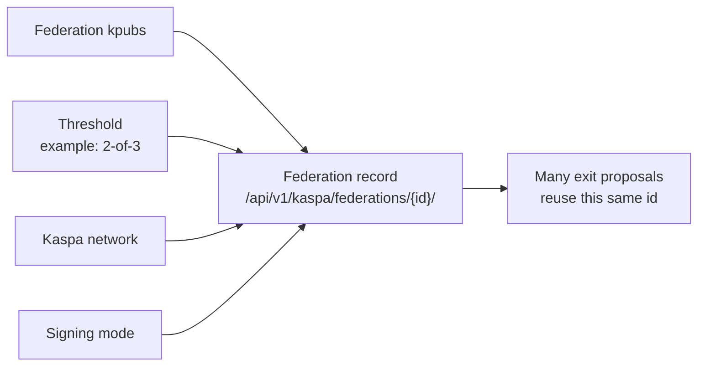
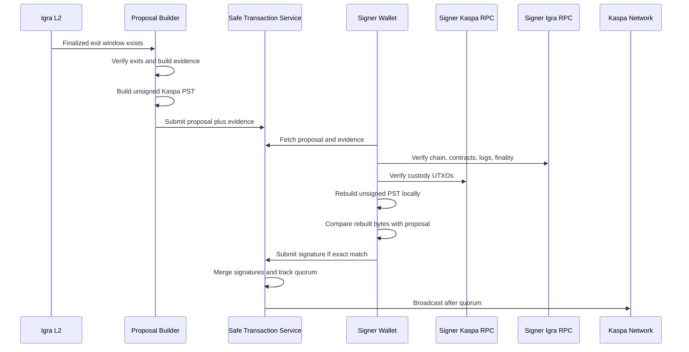
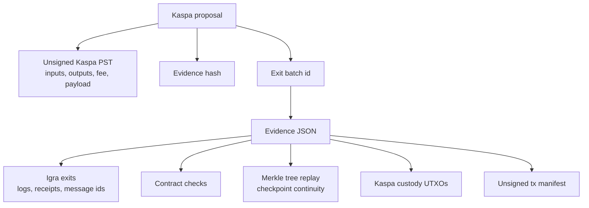
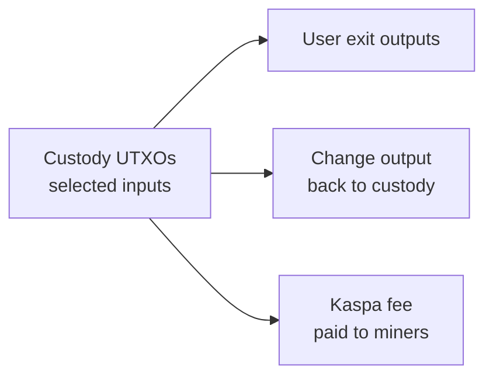
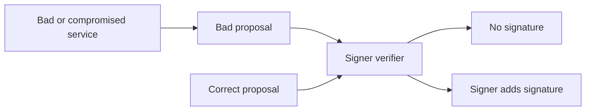

# Kaspa Federation Signer Guide

This guide is for federation members who approve Igra bridge exits from the
Kaspa custody wallet.

It is written for operators and signers, not only engineers. The main idea is:

```text
Do not sign because a service asked you to sign.
Sign only after your own wallet independently proves the proposal is correct.
```

For examples, assume Igra Labs operates Safe Transaction Service at:

```text
https://igralab.com/safe-transaction-service
```

Replace that URL with the production URL supplied by Igra Labs.

## Big Picture

The federation controls a Kaspa custody wallet. Users request exits on Igra L2.
For each finalized group of exits, a proposal is created to pay users on Kaspa.
Federation members verify and sign that proposal.



The important security boundary is at the signer wallet:



Safe Transaction Service coordinates the process. It does not decide whether a
proposal is safe for you to sign. Your wallet makes that decision locally.

## Who Does What

| Role | What it does | What it must not do |
| --- | --- | --- |
| Proposal Builder | Watches finalized Igra exit windows, verifies bridge evidence, builds unsigned Kaspa proposals | Hold signer private keys |
| Safe Transaction Service | Stores federations, proposals, evidence, signatures, quorum state, and broadcast results | Act as a trust oracle for signers |
| Federation signer | Verifies proposals locally and signs only exact, reproducible transactions | Trust a proposal without local verification |
| Broadcaster | Broadcasts the final signed Kaspa transaction after quorum | Change the transaction after signatures |

## Important Words

| Term | Meaning |
| --- | --- |
| Federation | The Kaspa signer group, for example 2-of-3 signers |
| kpub | A public wallet key. It is safe to share; it cannot spend funds |
| Custody wallet | The Kaspa multisig wallet controlled by the federation |
| Proposal | The unsigned Kaspa transaction the federation is asked to sign |
| Evidence | The data needed to prove the proposal matches real Igra exits |
| PST | Partially Signed Transaction, the old `kaspawallet` multisig format |
| Quorum | The number of required signatures, for example 2 signatures in 2-of-3 |
| Kaspa fee | The Kaspa transaction fee paid from custody UTXOs |

## What Federation Members Need

Each signer needs:

- A signer-controlled machine for the wallet.
- The `kaspawallet` CLI from `IgraLabs/kaspad`, branch
  `kaspa-exit-proposal-verifier`.
- A local signer keys file, for example `signer.keys.json`.
- A trusted Kaspa RPC endpoint.
- A trusted Igra RPC endpoint.
- The agreed federation configuration.

The federation configuration includes:

- Kaspa network, for example `mainnet` or `devnet`.
- All federation kpubs.
- Threshold, for example `2-of-3`.
- Signing mode, usually Schnorr.
- Canonical Kaspa custody address.
- Custody derivation path.
- Igra chain id.
- Igra bridge contract addresses.

Private keys and mnemonics must stay local. Only public kpubs should be shared.

## Federation Registration

Safe Transaction Service needs one federation record for each Kaspa signer set.



You do not register a new federation for every exit proposal. Reuse the same
federation for every exit window handled by the same signer set.

Create a new federation only when the Kaspa custody signer set changes:

- kpubs changed
- threshold changed
- Kaspa network changed
- signing mode changed
- key rotation created a new custody wallet

Different Igra exit windows do not require new federation records. Different
Igra bridge contract configuration is part of the proposal evidence and builder
configuration; it does not by itself create a new Kaspa signer federation.

The main API paths are:

```text
POST /api/v1/kaspa/federations/
GET  /api/v1/kaspa/federations/{federation_id}/
GET  /api/v1/kaspa/federations/{federation_id}/transactions/
GET  /api/v1/kaspa/transactions/{proposal_hash}/
GET  /api/v1/kaspa/exit-batches/{exit_batch_id}/evidence/
POST /api/v1/kaspa/transactions/{proposal_hash}/signatures/
POST /api/v1/kaspa/transactions/{proposal_hash}/broadcast/
```

Most signers should use the wallet commands rather than calling these APIs
manually.

## Per-Proposal Flow

This is what happens for one exit proposal.



A signer normally performs only these actions:

1. Receive or discover a `proposal_hash`.
2. Run `verify-exit-proposal`.
3. Review the high-level result: recipient count, total amount, fee, change
   address, txid.
4. Run `sign-exit-proposal` only if verification passes.
5. Submit the signed bundle to Safe Transaction Service.
6. Watch quorum and broadcast status.

## What The Proposal Contains

A proposal is not just "please sign this transaction." It includes or points to
evidence so each signer can verify the transaction independently.



Evidence includes:

- Kaspa network and Igra chain id.
- Exit window: `fromBlock`, `toBlock`, finalized block, confirmation settings.
- Required Igra contracts: KasExitBridge, Mailbox, MerkleTreeHook.
- Kaspa custody address, script public key, derivation path, threshold, kpubs,
  and signing mode.
- Each exit: request id, message id, transaction hash, recipient, and amount.
- Bundle verification results: exit checks, tree checks, checkpoint data, and
  contract preverification.
- Selected Kaspa custody UTXOs.
- Unsigned transaction manifest and verification report.

The evidence hash is canonical JSON SHA-256. If the downloaded evidence does
not hash to the proposal's `exit_evidence_hash`, signing must stop.

## What Your Wallet Verifies

Your wallet verifier asks one question:

```text
Can I independently rebuild the exact same unsigned Kaspa transaction from
public chain data and the agreed federation configuration?
```

It checks:

| Area | What is verified |
| --- | --- |
| Evidence | Evidence hash matches the proposal |
| Federation | kpubs, threshold, signing mode, custody address, derivation path |
| Igra chain | chain id, finalized window, expected bridge contracts |
| Igra exits | successful receipts, logs, message ids, recipients, amounts |
| Merkle proof | tree replay and checkpoint continuity |
| Kaspa UTXOs | selected custody UTXOs are live, unspent, mature, and correct |
| Kaspa transaction | inputs, outputs, change, fee, payload, txid |
| Final bytes | locally rebuilt unsigned PST equals proposed PST exactly |

If any check fails, do not sign.

## Signer Commands

First verify without decrypting private keys:

```bash
kaspawallet verify-exit-proposal \
  --keys-file /secure/path/signer.keys.json \
  --safe-url https://igralab.com/safe-transaction-service \
  --proposal-hash <proposal_hash> \
  --igra-rpc-url https://your-igra-rpc.example \
  --kaspa-rpc-url grpc://your-kaspa-rpc.example:16610
```

Then verify and sign:

```bash
kaspawallet sign-exit-proposal \
  --keys-file /secure/path/signer.keys.json \
  --safe-url https://igralab.com/safe-transaction-service \
  --proposal-hash <proposal_hash> \
  --igra-rpc-url https://your-igra-rpc.example \
  --kaspa-rpc-url grpc://your-kaspa-rpc.example:16610
```

The signing command runs the same verification first. It should decrypt private
keys only after verification succeeds.

After signing, submit the signed PST bundle to Safe Transaction Service:

```text
POST /api/v1/kaspa/transactions/{proposal_hash}/signatures/
```

Safe Transaction Service merges valid signatures and updates quorum state.

## Who Pays The Kaspa Fee

Kaspa does not use Ethereum-style gas. It uses transaction fees paid in sompi
from the Kaspa transaction itself.

For an exit proposal, the Kaspa fee is paid by the federation custody wallet.
It is deducted from the selected custody UTXOs when the final transaction is
broadcast.



Mechanically:

```text
fee = selected custody inputs - user exit outputs - custody change output
```

The fee is not paid personally by the signer at signing time. The signer is
approving a custody transaction whose fee comes from custody funds.

Reject a proposal if:

- the fee is unexpectedly high
- change does not return to the canonical custody address
- extra outputs exist
- output amounts differ from the evidence
- selected UTXOs are not live or mature

For mined devnet or testnet funds, coinbase UTXOs are spendable only after the
network maturity period. Production tooling must not select immature coinbase
UTXOs.

## Broadcasting

After enough signatures are collected, the proposal becomes ready. Igra Labs or
an assigned operator can broadcast it:

```text
POST /api/v1/kaspa/transactions/{proposal_hash}/broadcast/
```

Broadcasting does not change the transaction. The signatures already commit to
the exact transaction bytes.

After broadcast, signers should verify:

- the Kaspa txid exists on the expected network
- users received the expected outputs
- custody change returned to the canonical custody address
- the recorded broadcast txid matches the signed proposal

## Trust Model

The model is fail-closed.

Igra Labs may run the Proposal Builder and Safe Transaction Service, but that
does not mean signers must trust them. A compromised service can ask for a bad
signature, but a correctly verifying signer wallet should refuse to sign it.



The signer trusts:

- its own wallet binary and build process
- its own keys file and password handling
- its own confirmed federation configuration
- its own Igra RPC endpoint
- its own Kaspa RPC endpoint
- the deterministic verification algorithm

The signer does not automatically trust:

- Proposal Builder output
- Safe Transaction Service database state
- another signer
- proposal text or UI labels
- Igra Labs RPC responses unless the signer explicitly chooses to use those
  endpoints

## Practical Checklist

Before joining a federation:

- Confirm the kpub set and threshold out of band.
- Confirm the canonical custody address out of band.
- Confirm the Igra chain id and bridge contract addresses out of band.
- Build or install the signer wallet from the expected branch or tag.
- Configure independent Igra and Kaspa RPC endpoints.
- Run a devnet signing rehearsal before mainnet signing.

Before signing each proposal:

- Run `verify-exit-proposal`.
- Confirm the proposal hash and evidence hash.
- Review recipient count, total amount, fee, change address, and txid.
- Sign only with `sign-exit-proposal`.
- Submit the signed bundle to Safe Transaction Service.
- Watch quorum and broadcast status.

After broadcast:

- Verify the Kaspa transaction by txid.
- Confirm user outputs landed.
- Confirm custody change returned to the canonical custody address.
- Archive proposal hash, evidence hash, signed bundle hash, and broadcast txid.

## Technical Appendix

The verifier rebuilds the unsigned Kaspa PST from public data:

```text
verified Igra exits
+ verified custody UTXOs
+ federation kpubs and threshold
+ custody change policy
+ Kaspa fee
+ Igra exit payload nonce
= unsigned Kaspa PST
```

The Igra exit payload embedded in the Kaspa transaction is:

```text
0x93 || message_id_1 || ... || message_id_n || nonce_u32_be
```

The wallet signs only if:

```text
locally rebuilt PST bytes == proposal PST bytes
```

That byte-for-byte comparison is the main safety property. It prevents Safe
Transaction Service, Proposal Builder, or another signer from silently changing
recipients, amounts, fees, inputs, change, payload, or txid.
